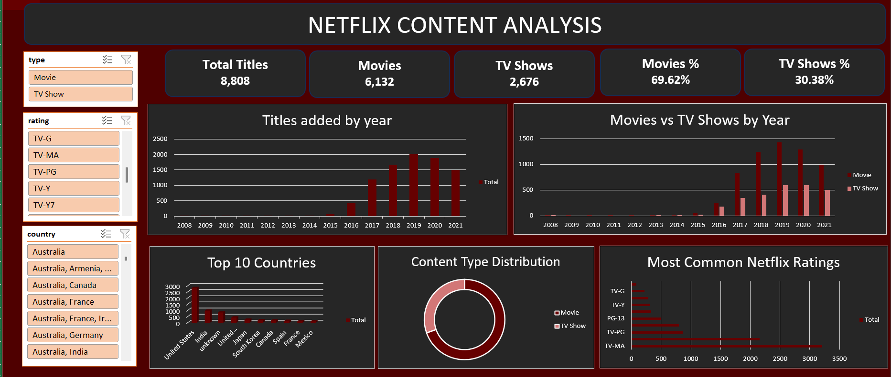

# Netflix Content Analysis Dashboard

An interactive Netflix Content Analysis Dashboard built using Microsoft Excel.

## Project Overview

This project analyzes Netflix titles to understand content trends, content types, ratings, and country-wise distribution.

I used Excel to clean and analyze the dataset and created an interactive dashboard using PivotTables, PivotCharts, KPI cards, and slicers.

## Dashboard

## Key Analysis

- Total Netflix titles
- Movies vs TV Shows
- Titles added by year
- Movies vs TV Shows by year
- Top 10 countries
- Content type distribution
- Most common Netflix ratings

## Interactive Features

The dashboard includes slicers for:

- Type
- Rating
- Country

These allow users to interactively filter the dashboard and explore different segments of the Netflix catalog.

## Tools & Techniques

- Microsoft Excel
- PivotTables
- PivotCharts
- Slicers
- KPI Cards
- Data Cleaning
- Data Analysis

## Key Insights

- Movies make up the majority of the Netflix catalog.
- Content additions increased significantly in the later years of the dataset.
- The United States has the highest number of titles among the top countries.
- TV-MA is one of the most common ratings in the dataset.

## Files

- `Netflix_Content_Analysis.xlsx` — Excel workbook containing the analysis and interactive dashboard.
- `netflix_dashboard.png` — Dashboard preview.
